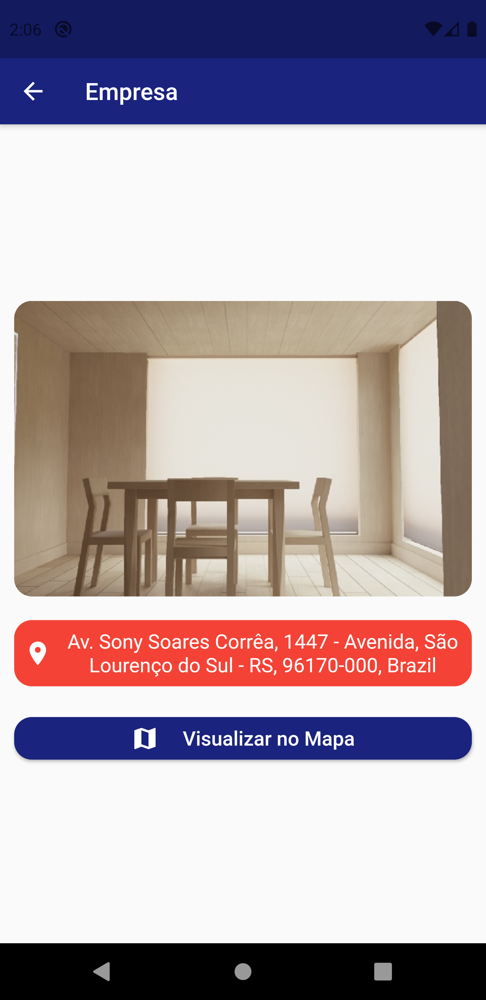
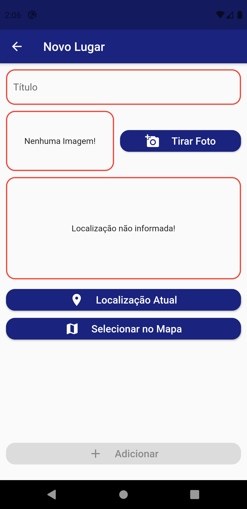
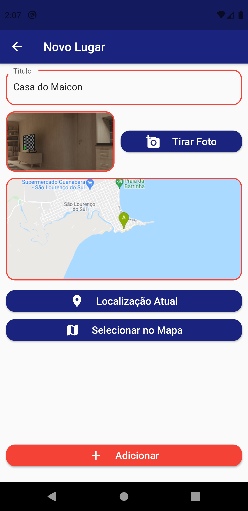
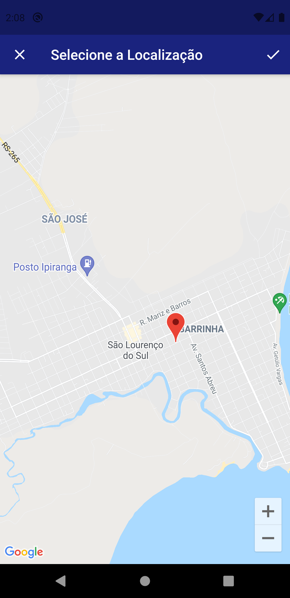

# Great Places

# Sobre o Projeto
O Great Places é um aplicativo desenvolvido em Flutter para registrar fotos e a localização do lugares bonitos. O projeto foi desenvolvido durante o curso de desenvolvimento Flutter da Cod3r. Foi um projeto bem interessante e cheio de novos conhecimentos. 

# Layout

     

# Funcionamento

O aplicativo é bem simples, na página inicial é mostrado todos os lugares já salvos. Também é possível adicionar um novo local e visualizar mais detalhes sobre um determinado lugar. Na tela de adicionar um novo local o título deve ser preenchido, deve-se tirar uma foto e também adicionar a localização, que pode ser feita de duas maneiras: utilizando a localização atual ou inserindo no mapa. Com todas informações preenchidas o botão de adicionar é liberado para realizar a gravação das informações do local no banco de dados.

Foram utilizados recursos como API de localização do Google, a câmera para registrar as fotos, o banco de dados SQLite do próprio celular e a gerencia de estados com Provider.

# Objetivo

O objetivo do desenvolvimento deste projeto foi ter conhecimento sobre como utilizar a câmera e o serviço do localização do Google em um aplicativo, assim como estudar um pouco como funciona o gerenciamento de estados com Provider. O layout também foi outro ponto que foi estudado, com o objetivo de deixar o app mais bonito e aprender a trabalhar com diferentes layouts.

# Como Utilizar?

~~~
- Clonar o repositório:
$ git clone https://github.com/murilobohlke/great-places.git

- Entrar no diretório:
$ cd great-places/great_places

- É preciso ter a chave da API de localização do Google. É preciso colocar a chave no arquivo lib\utilis\location_util.dart.

- Instalar as dependências:
$ flutter pub get

- Iniciar o app: 
$ flutter run
~~~

# Tecnologias Utilizadas
- Flutter
- Provider
- Image Picker
- Sqflite
- Google Maps Flutter
- Http

# Autor
Murilo Steinmetz Böhlke

